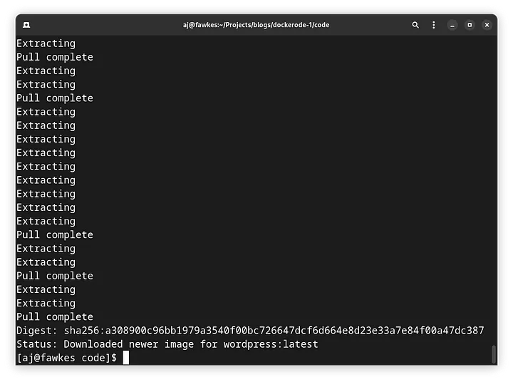
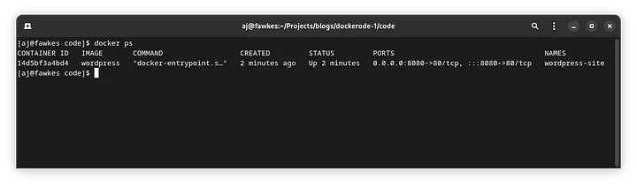
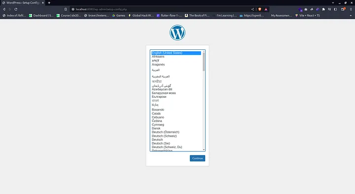
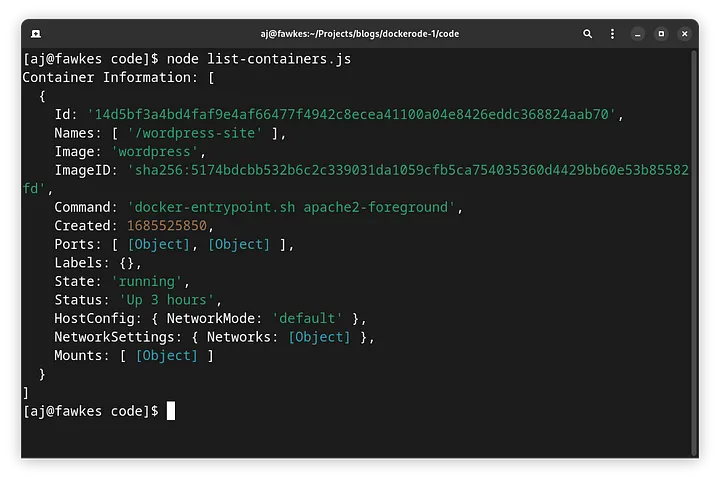

In this blog we will see how to manage docker containers using Node js.

Installing Dockerode

```
npm install dockerode
```

**1. Create and Starting a container**

Import Dockerode and create a Docker client instance

```javascript
const Docker = require('dockerode');  
const docker = new Docker();
```

Specify the port mapping configuration for your container.

```javascript
const portBindings = {  
  '3000/tcp': [{ HostPort: '8000' }]  
};
```

In the above example, we are mapping port 3000 inside the container to port 8000 on the host.

Pull the docker image from docker hub

```javascript
    docker.pull('wordpress', function (err, stream) {  
    //...  
    docker.modem.followProgress(stream, onFinished, onProgress);  
  
    function onFinished(err, output) {  
  
    }  
    function onProgress(event) {  
  
    }  
});
```

Now to create and start a container with the specified port mapping:

```javascript
const container = await docker.createContainer({  
  Image: 'your-image-name',  
  AttachStdin: false,  
  AttachStdout: true,  
  AttachStderr: true,  
  Tty: true,  
  ExposedPorts: { '3000/tcp': {} },  
  HostConfig: {  
    PortBindings: portBindings  
  }  
});//creates the container  
  
await container.start(); //starts the container
```

Replace the ‘your-image-name’ with the name of the image you want to run. At this point your container will start running in the specified port.

Starting A Wordpress Container using Dockerode

```javascript
const Docker = require('dockerode');  
const docker = new Docker();  
  
const portBindings = {  
    '80/tcp': [{ HostPort: '8080' }]  
};  
  
const pullContainer = async()=>{  
    await docker.pull('wordpress', function (err, stream) {  
        //...  
        docker.modem.followProgress(stream, onFinished, onProgress);  
      
        function onFinished(err, output) {  
            createContainer();  
        }  
        function onProgress(event) {  
            if (event.status === 'Downloading') {  
                process.stdout.clearLine(0);  
                process.stdout.cursorTo(0);  
                process.stdout.write(event.progress);  
      
            }else{  
                process.stdout.clearLine(0);  
                process.stdout.cursorTo(0);  
                process.stdout.write(event.status+"\n")  
            }  
        }  
    });  
}  
  
const createContainer = async () => {  
    const container = await docker.createContainer({  
        Image: 'wordpress',  
        AttachStdin: false,  
        AttachStdout: true,  
        AttachStderr: true,  
        Tty: true,  
        ExposedPorts: { '80/tcp': {} },  
        HostConfig: {  
          PortBindings: portBindings  
        },  
        name: 'wordpress-site'  
      });  
  
      await container.start();  
}  
  
  
pullContainer();
```


Using docker ps command we can see that wordpress is running successfully


Wordpress is started successfully on port 8080




**2.** **List all the containers in the system**

```javascript
const Docker = require('dockerode');  
const docker = new Docker();  
docker.listContainers((err, containers) => {  
    if (err) {  
      console.log('Error:', err);  
    } else {  
      console.log('Container Information:', containers);  
    }  
  });
```

The `listContainers` method returns an array of container objects, where each object represents a container running on the Docker host. The objects contain information such as container ID, names, image, status, ports, and more.



**3. Stop all the running containers**

```javascript
const Docker = require('dockerode');  
const docker = new Docker();  
docker.listContainers(function (err, containers) {  
  containers.forEach(function (containerInfo) {  
    docker.getContainer(containerInfo.Id).stop(cb);  
  });  
});
```

Using `getContainer` method we can get the container by providing the container ID. using `stop` we can stop the container.