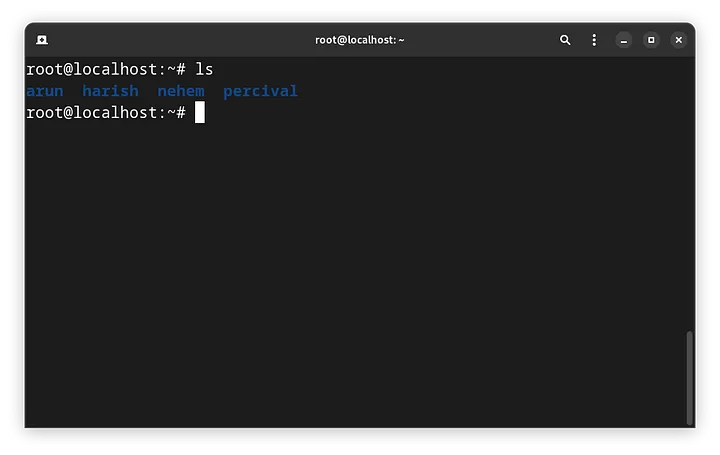
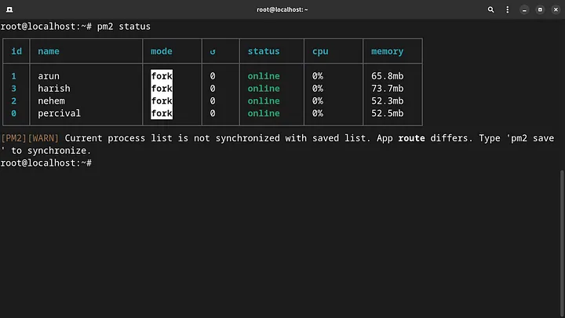
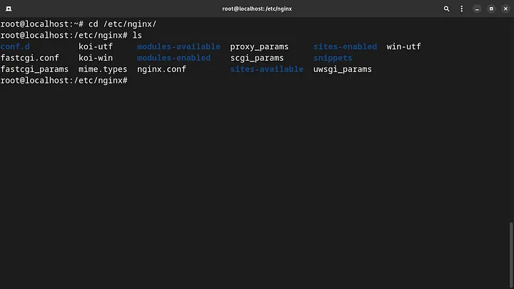
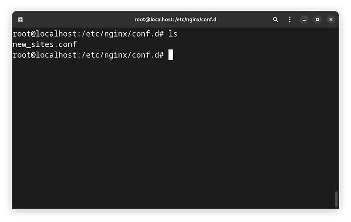
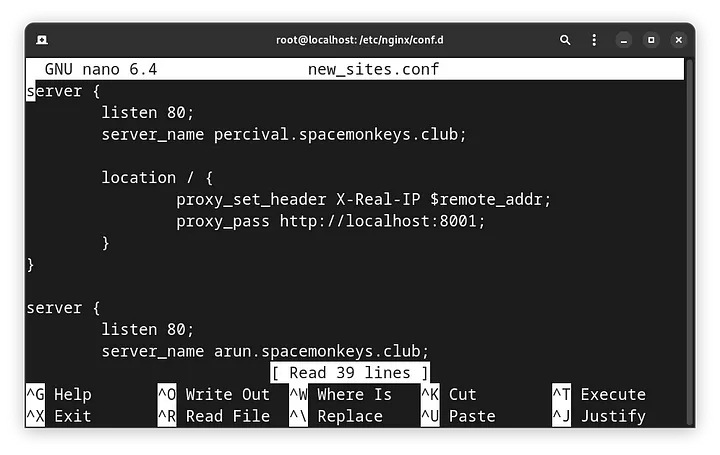

In this article, we will see how to host multiple Node.js sites on a single server using PM2 and Nginx.

# Install the Dependencies

- Node.js: [https://nodejs.org/en/download](https://nodejs.org/en/download)
- MongoDB (if needed): [https://www.mongodb.com/docs/manual/administration/install-on-linux/](https://www.mongodb.com/docs/manual/administration/install-on-linux/)
- PM2: npm install pm2 — global
- Nginx: sudo apt install nginx

# **Run the server Programs**

Here we have some sites that we should host


Each folders have a server.js file that we will run to start the site. Assign different ports for all the program to run. I my case, I choose ports 8001- 8004. Using PM2 start the server:

```
pm2 start server.js --name <alias>
```

Do this for all the sites. To view the status:

```
pm2 status
```



Once all of your sites are enabled, It’s time to start configuring the nginx.

# Configuring Nginx

Navigate the nginx folder

```
cd /etc/nginx
```




Go to conf.d folder and create a new file with .conf extension

```
cd conf.d  
touch new_sites.conf
```


**Now lets create a new server block for all our sites**

```
nano new_sites.conf
```



```
server {  
 listen 80;  
 server_name <domain1>;  
   
 location / {  
  proxy_set_header X-Real-IP $remote_addr;  
  proxy_pass http://localhost:8001;  
 }  
}  
  
server {  
        listen 80;      
        server_name <domain2>;  
          
        location / {  
                proxy_set_header X-Real-IP $remote_addr;  
                proxy_pass http://localhost:8002;  
        }  
}  
  
server {  
        listen 80;      
        server_name <domain3>;  
          
        location / {  
                proxy_set_header X-Real-IP $remote_addr;  
                proxy_pass http://localhost:8003;  
        }  
}  
  
server {  
        listen 80;  
        server_name <domain4>;  
  
        location / {  
                proxy_set_header X-Real-IP $remote_addr;  
                proxy_pass http://localhost:8004;  
        }  
}
```

save the file and exit.

**Run the Nginx test**

```
nginx -t
```


Once you see this output, you are good to go and can restart the Nginx service:

```
systemctl reload nginx.service
```

You have successfully hosted multiple Node.js sites on a single server.
