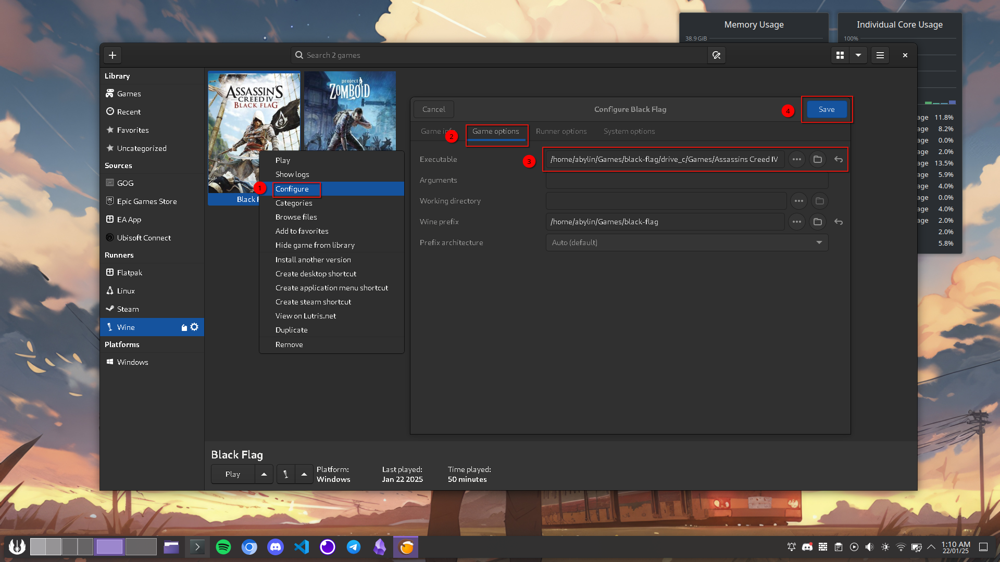

I am currently running Arch Linux (Endevour OS) on my machine with NVIDIA graphics.

Currently I have installed lutris and wine in the machine. I have used FlatPak to install lutris and also install wine tricks.

## Installation Process

Here is how you can install games in Lutris. 

1. Click on the add button and click on "Install a Windows game from an executable" 

    

2. Enter the name you want and click on install

    

3. Click on install to install the Wine setup

    

4. Select the file location where you want to install the game on your PC and click on continue

    

5. Select the setup file that you have in your local machine and click on install.

    

    

This will run you through windows installer and the game will be installed in your machine.

## Common Errors

Here are some common error that you will encounter and how to fix it.

1. ``archive data corrupted decompression fails`` or ``An error occured while unpacking: Not enough memory!`` this error can be tackled by switching the runner to "System".

    

2. ``Initial process has exited (return code: 0)`` this error comes if the path of the game set properly

    

    Mostly this will be the location for the Executable

    

Happy Hacking !!!