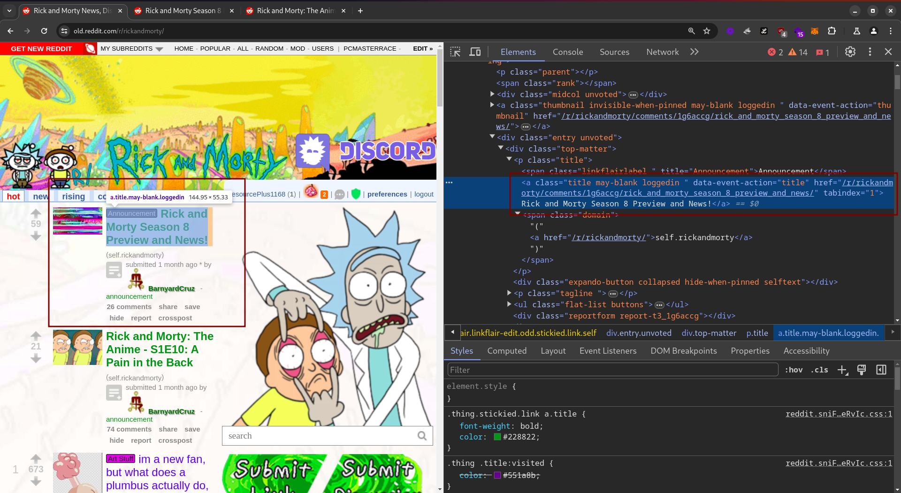
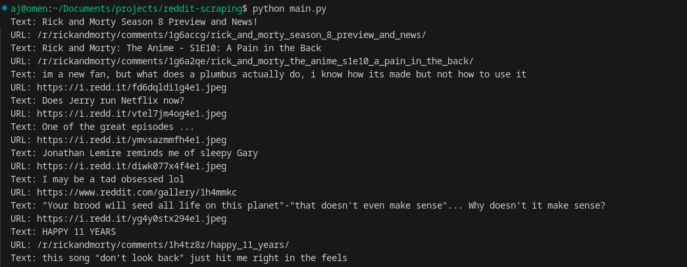
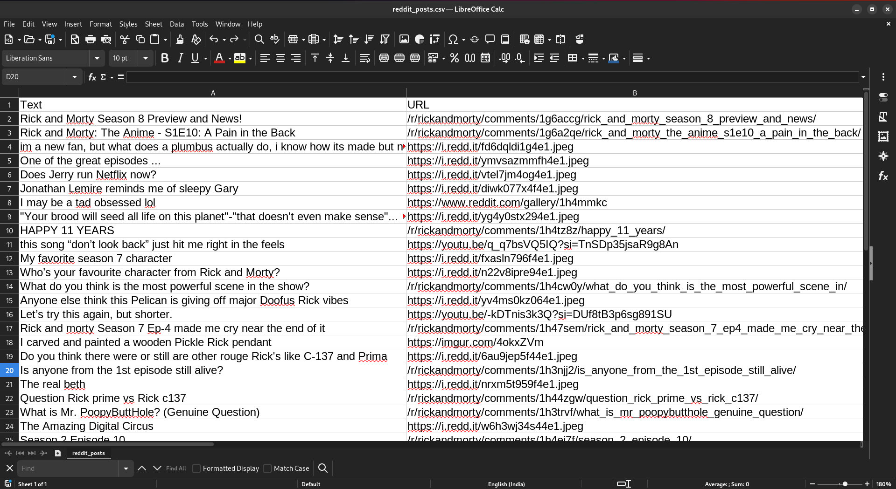
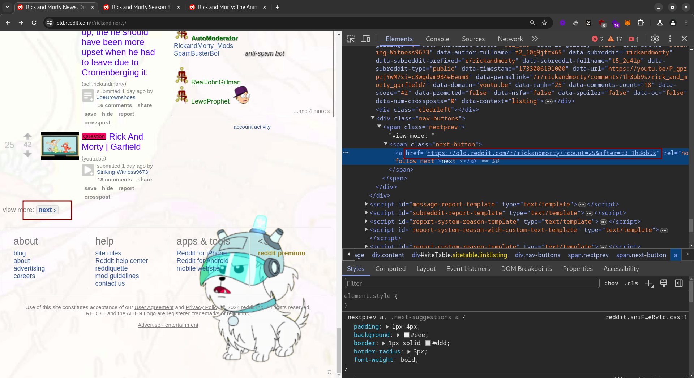
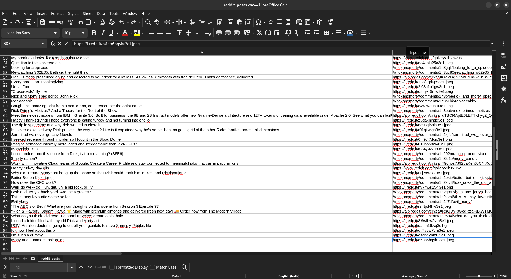

This blog demonstrates how to scrape data from web directories, which are mostly static pages. The example we will use is **Old Reddit**.


Here, in the subreddit, we can see a list of posts. We will be scraping all the posts from this subreddit. Before starting to scrape the data, we need to understand how the webpage works and how everything is rendered in the UI. In our case, we can observe that the URL of the post and the title of the post are in the same `<a>` tag.



To scrape the data, we will use Python's `requests` and `BeautifulSoup`. Install BeautifulSoup using the following command:

```bash
pip install bs4
```

Here is the code to get all the posts with their URL and title:

```python
import requests
from bs4 import BeautifulSoup

# URL of the page to scrape
url = 'https://old.reddit.com/r/rickandmorty'

# Send a GET request to the URL
response = requests.get(url)

# Parse the HTML content of the page
soup = BeautifulSoup(response.content, 'html.parser')

# Find all 'a' tags with the class 'title'
a_tags = soup.find_all('a', class_='title')

# Loop through the found 'a' tags and print their text and URL
for tag in a_tags:
    print(f"Text: {tag.get_text()}")
    print(f"URL: {tag['href']}")
```

On running the code, you will get an output like this:



You’ll notice that the URL starts with `/r/`. You need to append the parent domain to get the complete URL:

```python
# Loop through the found 'a' tags and print their text and URL
for tag in a_tags:
    print(f"Text: {tag.get_text()}")
    print(f"URL: https://old.reddit.com{tag['href']}")
```

Another improvement you can make is storing the data in a CSV file or an SQLite database. For simplicity, we will store the data in CSV format:

```python
import requests
from bs4 import BeautifulSoup
import csv

# URL of the page to scrape
url = 'https://old.reddit.com/r/rickandmorty'

# Send a GET request to the URL
response = requests.get(url)

# Parse the HTML content of the page
soup = BeautifulSoup(response.content, 'html.parser')

# Find all 'a' tags with the class 'title'
a_tags = soup.find_all('a', class_='title')

# Open a CSV file to write the data
with open('reddit_posts.csv', mode='w', newline='', encoding='utf-8') as file:
    writer = csv.writer(file)
    # Write the header row
    writer.writerow(['Text', 'URL'])
    
    # Loop through the found 'a' tags and write their text and URL to the CSV file
    for tag in a_tags:
        writer.writerow([tag.get_text(), f"https://old.reddit.com{tag['href']}"])
```

Once you run the code, a CSV file will be generated with the data:



### Scraping Data Across Multiple Pages

Now, let’s move on to the tricky part: scraping data across multiple pages. 


In our case, a parameter is appended to the URL to load posts after a particular post ID. Instead of manually generating the URL using the post ID, we can extract it from the "NEXT" button:



We now modify our code to iterate through pages using the URL found in the `<a>` tag within the "next-button" class:

```python
import requests
from bs4 import BeautifulSoup
import csv

# URL of the first page to scrape
url = 'https://old.reddit.com/r/rickandmorty'

# Open a CSV file to write the data
with open('./reddit_posts.csv', mode='w', newline='', encoding='utf-8') as file:
    writer = csv.writer(file)
    # Write the header row
    writer.writerow(['Text', 'URL'])

    # Initialize the page count
    page_count = 3
    
    while url:
        # Send a GET request to the URL
        response = requests.get(url, headers={'User-agent': 'Mozilla/5.0'})
        print(response.status_code)
        
        # Parse the HTML content of the page
        soup = BeautifulSoup(response.content, 'html.parser')

        # Find all 'a' tags with the class 'title'
        a_tags = soup.find_all('a', class_='title')

        # Loop through the found 'a' tags and write their text and URL to the CSV file
        for tag in a_tags:
            writer.writerow([tag.get_text(), f"https://old.reddit.com{tag['href']}"])

        # Find the 'span' tag with the class 'next-button' and then the 'a' tag within it
        next_button_span = soup.find('span', class_='next-button')
        if next_button_span:
            next_button = next_button_span.find('a')
            if next_button:
                url = next_button['href']
            else:
                url = None
        else:
            url = None
        
        # Decrement the page count
        page_count -= 1
        if page_count == 0:
            break
```



Here, I’ve limited the script to iterate through three pages, but you can adjust it to scrape more pages and gather additional data. 

This covers the basics of scraping static web directories.

**Happy Hacking!**