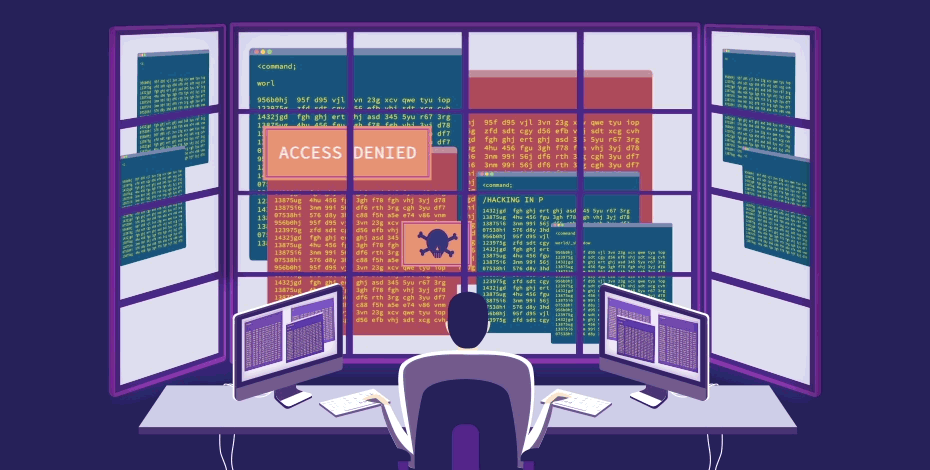
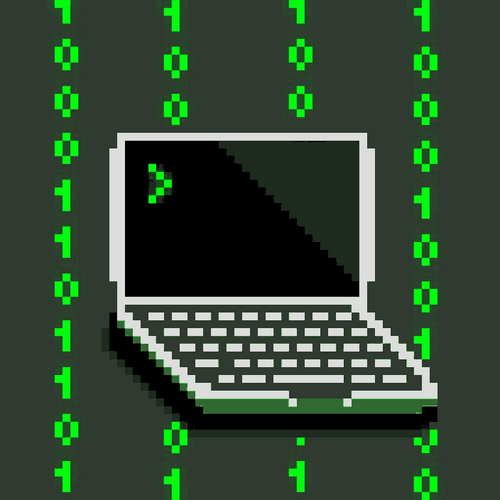

I have recently completed the Wreath network from TryHackMe, and I must say it was an incredible learning experience. This network consists of three machines: a Linux web server, a Windows-based Git server, and a Windows machine running an antivirus application. Although the contents of the network may initially seem daunting, it is actually quite beginner-friendly. Despite its appearance, it is an easy machine to work with and offers a wealth of valuable information. Completing this machine will undoubtedly enhance your knowledge and skills significantly.

The Wreath network covered a wide range of essential topics in cybersecurity, making it an ideal choice for beginners seeking to enhance their skill set. Here are the key topics I explored during the Wreath network:

**Topics Covered:**

- **Enumeration**: Enumeration is the process of gathering information about a target system or network. It involves searching for open ports, services, users, shares, and other valuable data to identify potential vulnerabilities.

- **Pivoting:** Pivoting is the technique of using a compromised machine (or “pivot point”) to gain access to other machines within the network. It allows attackers to move laterally through the network and escalate privileges.

- **Exploitation:** Exploitation refers to the process of taking advantage of vulnerabilities or weaknesses in a system or application to gain unauthorized access or control.

- **Command and Control:**  C2 (Command and Control) server is a central server that controls compromised machines or “bots” in a botnet. It is used by attackers to send commands and receive data from the infected machines.

- **AV Evasion:** AV (Antivirus) evasion involves techniques used to bypass or avoid detection by antivirus software. Attackers employ various methods to make their malicious payloads undetectable by security solutions.

The practical scenarios presented in the Wreath network allowed me to apply these concepts hands-on, gaining valuable insights into real-world cybersecurity scenarios and how to approach them effectively.

**Tools Used**

To explore the topics of pivoting and the functionality of a C2 server, I utilized various powerful tools. Here are the tools I used during the Wreath network:

**Pivoting:**

- **socat:** A versatile networking tool used for bidirectional data streams between two endpoints, commonly used for port forwarding, proxying, and pivoting.
- **sshuttle:** Enables dynamic VPN-like behavior over SSH, allowing traffic forwarding through an SSH connection to create secure tunnels for pivoting.
- **chisel:** A fast and lightweight TCP tunnel used to tunnel through multiple layers of NAT and firewall configurations, ideal for pivoting through restrictive network environments.
- **plink:** A command-line interface to the PuTTY backend (PSCP and PSFTP) and is commonly used to set up SSH connections for tunneling and pivoting.

**C2 Server:**

- **Empire C2:** An open-source, post-exploitation C2 framework that allows an attacker to interact with compromised systems remotely. Empire provides a range of modules for controlling compromised hosts and executing actions on target systems.

By employing these tools, I was able to gain valuable insights into pivoting techniques and the functionality of a C2 server. Each tool served a specific purpose in exploring these concepts and understanding how attackers can move laterally within a network and maintain control over compromised systems.

Always remeber to take good notes. The tools you use in this machines are common and It may come in handy while doing other machines and assessments. Play around the network and try using various tools and try tools that are not mentioned like try using a different C2 server. This machine not only about getting the flags but a remarkable opportunity to acquire a diverse range of skills.